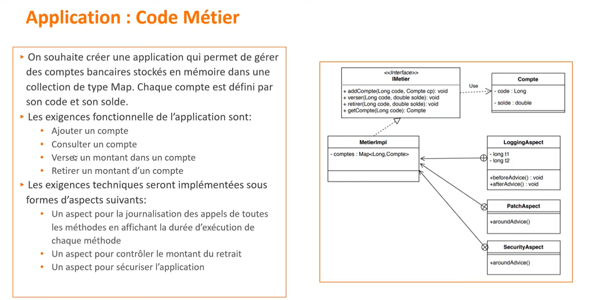
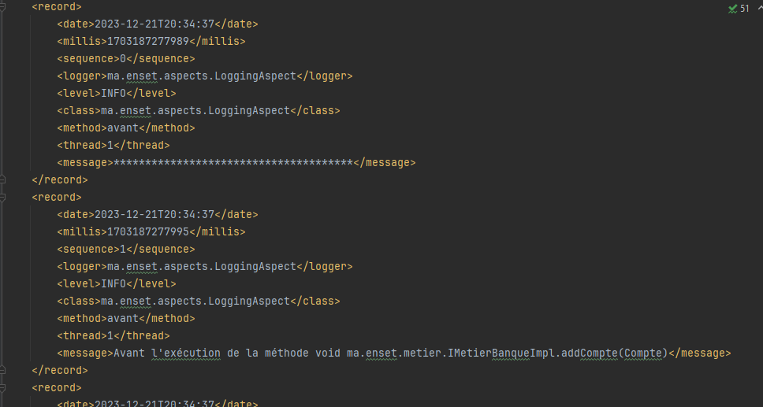

## Aspect Oriented Programming with AspectJ and Spring AOP - AspectJ User case ✍️


### Introduction
L'objectif de cette activité est de mettre en place un ensemble d'aspects : log, sécurité et d'autres aspects qui sont utiles pour notre application à l'aide de Spring AOP.

### Application

### Ajout des dépendances
Pour utiliser Spring AOP, il faut ajouter les dépendances suivantes dans le fichier pom.xml:
```xml

<dependencies>
    <dependency>

        <groupId>org.springframework</groupId>
        <artifactId>spring-core</artifactId>
        <version>5.2.5.RELEASE</version>
    </dependency>
    <dependency>

        <groupId>org.springframework</groupId>
        <artifactId>spring-context</artifactId>
        <version>5.2.5.RELEASE</version>
    </dependency>
    <dependency>

        <groupId>org.springframework</groupId>
        <artifactId>spring-beans</artifactId>
        <version>5.2.5.RELEASE</version>
    </dependency>
    <dependency>

        <groupId>org.springframework</groupId>
        <artifactId>spring-aop</artifactId>
        <version>5.2.5.RELEASE</version>
    </dependency>
    <dependency>
        <groupId>org.springframework</groupId>
        <artifactId>spring-aspects</artifactId>
        <version>5.2.5.RELEASE</version>
    </dependency>
</dependencies>
```

### Création des classes
Nous avons créé les classes suivantes:
- **IMetierBanque** : Cette interface contient les méthodes qui seront exécutées.
```java
public interface IMetierBanque {
    void addCompte(Compte cp);
    void verser(Long code, double montant);
    void retirer(Long code, double montant);
    Compte consulter(Long code);

}
```
- **IMetierBanqueImpl**: Cette classe implémente l'interface **IMetierBanque** et contient les méthodes qui seront exécutées.

```java
public class IMetierBanqueImpl implements IMetierBanque {
    private Map<Long, Compte> comptes = new HashMap<>();
    @Override
    public void addCompte(Compte cp) {
        comptes.put(cp.getCode(), cp);
    }

    @Override
    public void verser(Long code, double montant) {
        Compte cp = comptes.get(code);
        cp.setSolde(cp.getSolde() + montant);
    }

    @Override
    public void retirer(Long code, double montant) {
        Compte cp = comptes.get(code);
        cp.setSolde(cp.getSolde() - montant);
    }

    @Override
    public Compte consulter(Long code) {
        return comptes.get(code);
    }
}
```
#### Pour le log
Nous allons créer les classes suivantes:
- **LogAspect** : qui contient une méthode **around** qui sera exécutée avant et après l'exécution des méthodes de la classe **IMetierBanqueImpl**. Cette classe contient aussi une méthode **pc1** qui permet de définir le point de coupe.
```java
@Aspect
public class LoggingAspect {
    Logger logger = Logger.getLogger(LoggingAspect.class.getName());
    long t1, t2;


    public LoggingAspect() throws IOException {
        logger.addHandler(new FileHandler("test.xml"));
        logger.setUseParentHandlers(false);
    }

    @Pointcut("execution(* ma.enset.metier.IMetierBanqueImpl.*(..))")
    public void pc1() {
    }
    

    @Around("pc1()")
    public Object around(ProceedingJoinPoint pjp, JoinPoint jp) throws Throwable {
        t1 = System.currentTimeMillis();
        logger.info("Avant l'exécution de la méthode " + jp.getSignature());
        Object object = pjp.proceed();
        logger.info("Après l'exécution de la méthode" + jp.getSignature());
        t2 = System.currentTimeMillis();
        logger.info("Durée d'exécution de la méthode " + pjp.getSignature() + " est " + (t2 - t1) + " ms");
        return object;
    }

}
```
On va utiliser le fichier **log.xml** pour stocker les logs. 


#### Pour vérifier le solde du compte avant chaque opération de retrait
Nous allons créer les classes suivantes:
- **PatchRetraitAspect**
```java
@Aspect
public class PatchRetraitAspect {
    @Pointcut("execution(* ma.enset.metier.IMetierBanqueImpl.retirer(..))")
    public void pc1() {
    }

    @Around("pc1() && args(code, montant)")
    public Object around(Long code, double montant, ProceedingJoinPoint pjp, JoinPoint jp) throws Throwable {
        IMetierBanqueImpl metier = (IMetierBanqueImpl) jp.getTarget();
        Compte compte = metier.consulter(code);
        if (compte.getSolde() < montant) throw new RuntimeException("Solde insuffisant");
        return pjp.proceed();
    }

}
```
Si on tente à retirer un montant supérieur au solde du compte, on aura une exception **RuntimeException**.

#### Pour la sécurité
Nous allons créer les classes suivantes:
- **SecurityAspect** : qui contient une méthode **around** qui sera exécutée avant et après l'exécution des méthodes de la classe **IMetierBanqueImpl**. Cette classe contient aussi une méthode **pc2** qui permet de définir le point de coupe.
```java
@Aspect
public class SecurityAspect {
    @Pointcut("execution(* ma.enset.test.Application.start(..))")
    public void startPC() {

    }

    @Around("startPC()")
    public void autourStart(ProceedingJoinPoint pjp) throws Throwable {
        Scanner scanner = new Scanner(System.in);
        System.out.println("Entrer username:");
        String username = scanner.nextLine();
        System.out.println("Entrer password:");
        String password = scanner.nextLine();
        if (!username.equals("admin") || !password.equals("1234")) System.out.println("Accès refusé");
        else pjp.proceed();

    }
}
```

Si on tente à exécuter l'application sans entrer le bon username et le bon password, on aura un message **Accès refusé**.


## Conclusion
Dans cette activité, nous avons appris à utiliser Spring AOP pour implémenter des fonctionnalités transversales dans notre application.
